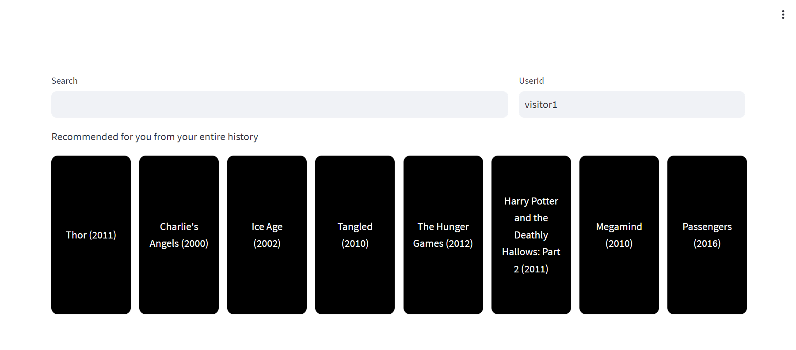
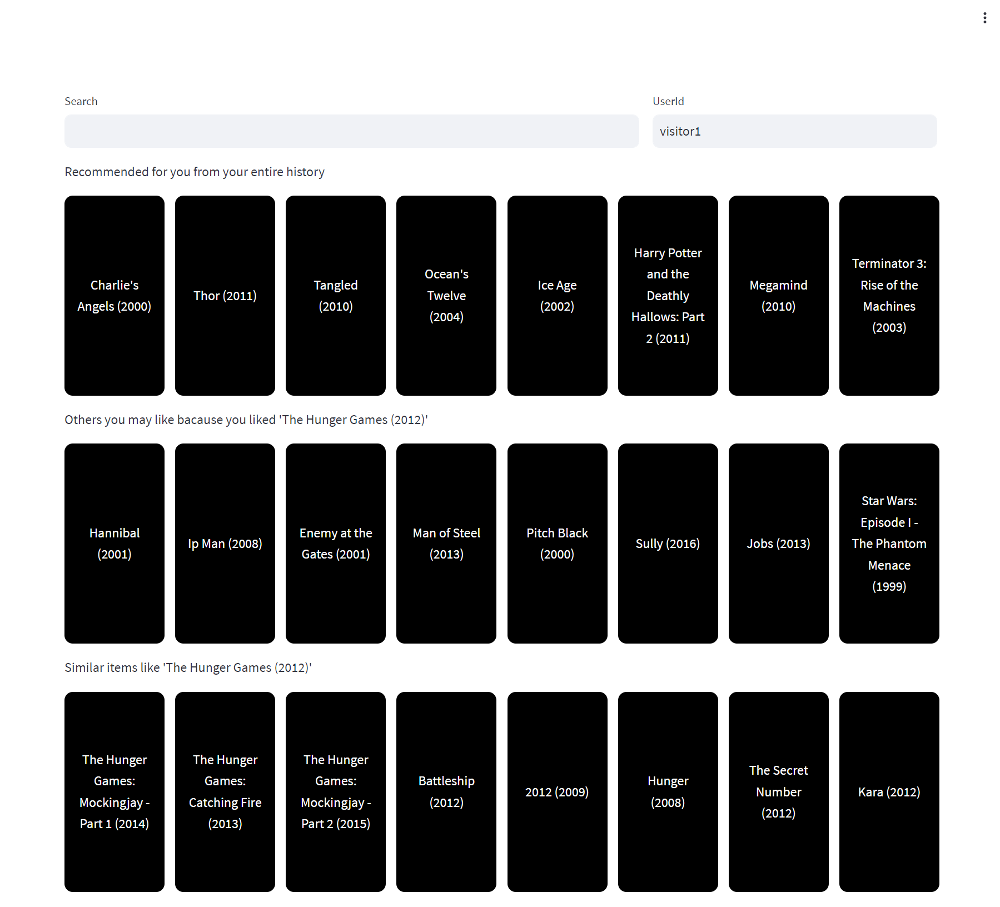
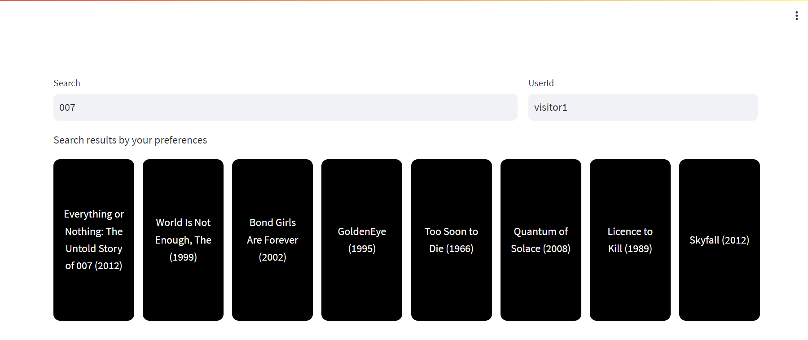

# Recommendations AI and Retail Search tester

## Brief
In this sample, you'll learn how to create Recommendations AI application using Google Cloud Recommendations AI API and streamlit
<div align="center"></div>
<div align="center"></div>
<div align="center"></div>

## Prepare sample dataset and model
Under following link there are 'Prepare the dataset' and 'Create BigQuery views' parts. Finish those parts to create movielens.products view. Skip movielens.user_events creation part.

https://cloud.google.com/retail/docs/movie-rec-tutorial

To create various types of models, we need to create new user events data.

Following query will create new user events table from existing data.
```
create table movielens.user_events_origin as (WITH t AS (
   SELECT
     MIN(UNIX_SECONDS(time)) AS old_start,
     MAX(UNIX_SECONDS(time)) AS old_end,
     UNIX_SECONDS(TIMESTAMP_SUB(
       CURRENT_TIMESTAMP(), INTERVAL 90 DAY)) AS new_start,
     UNIX_SECONDS(CURRENT_TIMESTAMP()) AS new_end
   FROM `movielens.ratings`)
 SELECT
   CAST(userId AS STRING) AS visitorId,
   "home-page-view" AS eventType,
   FORMAT_TIMESTAMP(
     "%Y-%m-%dT%X%Ez",
     TIMESTAMP_SECONDS(CAST(
       (t.new_start + (UNIX_SECONDS(time) - t.old_start) *
         (t.new_end - t.new_start) / (t.old_end - t.old_start))
     AS int64))) AS eventTime,
   [STRUCT(STRUCT(movieId AS id) AS product)] AS productDetails,
 FROM `movielens.ratings`, t
 WHERE rating >= 4);
``` 

Augment existing data
```
insert into `movielens.user_events_origin`( select visitorId, eventType, eventTime, productDetails from (WITH t AS (
   SELECT
     MIN(UNIX_SECONDS(time)) AS old_start,
     MAX(UNIX_SECONDS(time)) AS old_end,
     UNIX_SECONDS(TIMESTAMP_SUB(
       CURRENT_TIMESTAMP(), INTERVAL 90 DAY)) AS new_start,
     UNIX_SECONDS(CURRENT_TIMESTAMP()) AS new_end
   FROM `movielens.ratings`)
 SELECT   
   row_number() over() as rn,
   CAST(userId AS STRING) AS visitorId,
   "detail-page-view" AS eventType,
   FORMAT_TIMESTAMP(
     "%Y-%m-%dT%X%Ez",
     TIMESTAMP_SECONDS(CAST(
       (t.new_start + (UNIX_SECONDS(time) - t.old_start) *
         (t.new_end - t.new_start) / (t.old_end - t.old_start))
     AS int64))) AS eventTime,
   [STRUCT(STRUCT(movieId AS id) AS product)] AS productDetails,
 FROM `movielens.ratings`, t
 WHERE rating >= 4) where mod(rn, 2) = 0 );
```

Create view from augmented data
```
CREATE VIEW movielens.user_events as select * from movielens.user_events_origin;
```

## Import data into Recommendations AI
Follow 'Import product catalog and user events into Retail API' part.

https://cloud.google.com/retail/docs/movie-rec-tutorial#import_product_catalog_and_user_events_into_api

## Create models
In this sample, we'll create 4 Recommendation models.
Create model and its serving configs using same name and below type maps.
```
* movielens-pageoptimization (Page-level optimization)
* movielens-recommended-for-you (Recommended for you)
* movielens-others-you-may-like (Others you may like)
* movielens-similar (Similar items)
```

Create Retail Search serving config
```
* personalized-search (Search and Browse)
```

## Steps for launching dashboard
```
pip install -r requirements.txt             # Install libraries (tested on Python 3.10)
gcloud auth application-default login       # Set credential in your env
python -m streamlit run main.py PROJECT_ID  # Launch dashboard
```